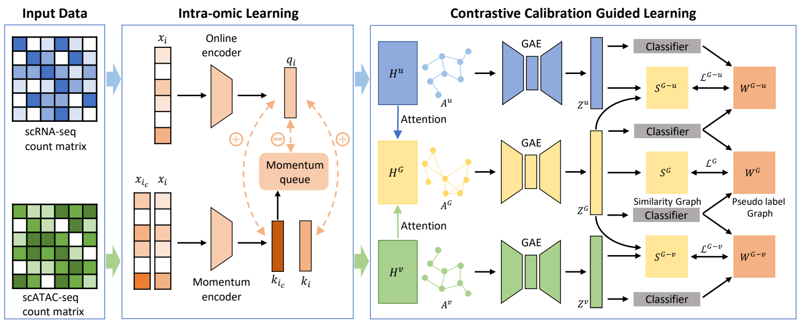

# scCCGR

scCCGR is a representation-learning framework for clustering paired
single-cell multi-omics data. It uses the fused multi-omics representation as
a global semantic anchor to align modality-specific representations without
discarding their complementary biological information. This repository
contains implementations for dual-omics integration (`scCCGR`, RNA + ATAC)
and tri-omics integration (`scCCGR_Tri`, RNA + ATAC + ADT).

## Framework



[View the vector PDF](assets/framework.pdf)

scCCGR is trained in two stages:

1. **Intra-modal contrastive learning.** A momentum contrastive-learning
   framework learns a robust embedding for each modality. 
2. **Contrastive calibration guided learning.** Cross-modal attention
   adaptively combines modality-specific embeddings into a fused
   representation. Graph autoencoders incorporate cell-cell topology into
   both modality-specific and fused embeddings. The graph-refined fused
   embedding then acts as a global semantic anchor: pseudo-label-guided
   contrastive objectives calibrate each modality branch against it.

The optimized fused embedding is used as the final representation for
K-means cell clustering.

## Repository layout

```text
.
|-- assets/                  # Framework figure files
|-- scCCGR/                  # Dual-omics RNA + ATAC workflow
|-- scCCGR_Tri/              # Tri-omics RNA + ATAC + ADT workflow
|-- .gitignore               # Excluded data and cache directories
|-- environment.yml          # Conda environment definition
|-- LICENSE                  # MIT License
`-- requirements.txt         # Key Python package versions
```

## Environment

To create it on another machine:

```bash
conda env create -f environment.yml
conda activate scccgr
```

The reference environment was validated with:

- Python 3.9.18
- PyTorch 2.7.0+cu126
- NumPy 1.26.4
- Pandas 2.3.3
- SciPy 1.11.3
- scikit-learn 1.3.2
- Scanpy 1.10.3
- AnnData 0.8.0
- MuON 0.1.6
- h5py 3.13.0
- hnswlib 0.8.0

The WNN scripts additionally require R with Seurat, Signac, igraph, and
aricode. 

## Data

Data are excluded from this repository. The expected 10x-style layout is:

```text
data/<dataset>/
|-- <dataset>_cluster.csv
|-- Processed_dataset/
|   |-- RNA/{barcodes.tsv,genes.tsv,matrix.mtx}
|   |-- ATAC/{barcodes.tsv,genes.tsv,matrix.mtx}
|   `-- ADT/{barcodes.tsv,genes.tsv,matrix.mtx}  # tri-omics only
```
To get dataset: https://drive.google.com/file/d/1WV88Gg3zt_IO4jY9vVqpIQlU7q_ZCgi2/view?usp=drive_link

## Running

Run commands from inside the selected implementation directory so that
relative input and output paths resolve correctly.

Dual-omics workflow:

```bash
cd scCCGR
Rscript WNN_construct.R
python train_moco.py --dataset PBMC_TEA
python train_contrast.py --dataset PBMC_TEA
```

Tri-omics workflow:

```bash
cd scCCGR_Tri
Rscript WNN_construct.R
python train_moco.py --dataset PBMC_TEA
python train_contrast.py --dataset PBMC_TEA
```

The scripts currently select CUDA devices in source (`cuda:1`, `cuda:2`, or
`cuda:3`). Adjust these values to match the available GPU before running.
Generated embeddings are written to `lowdimention/`.
